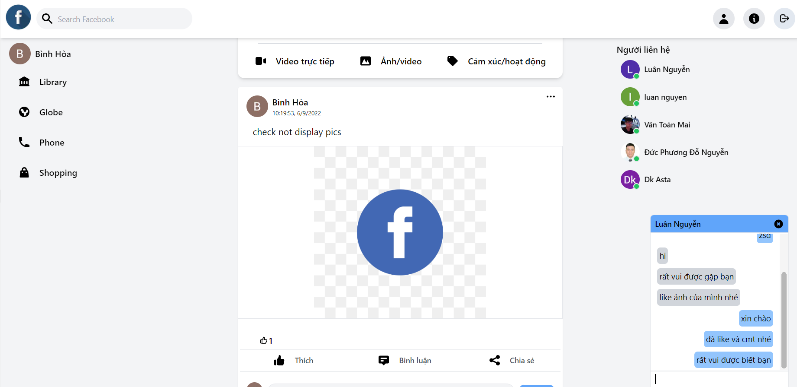
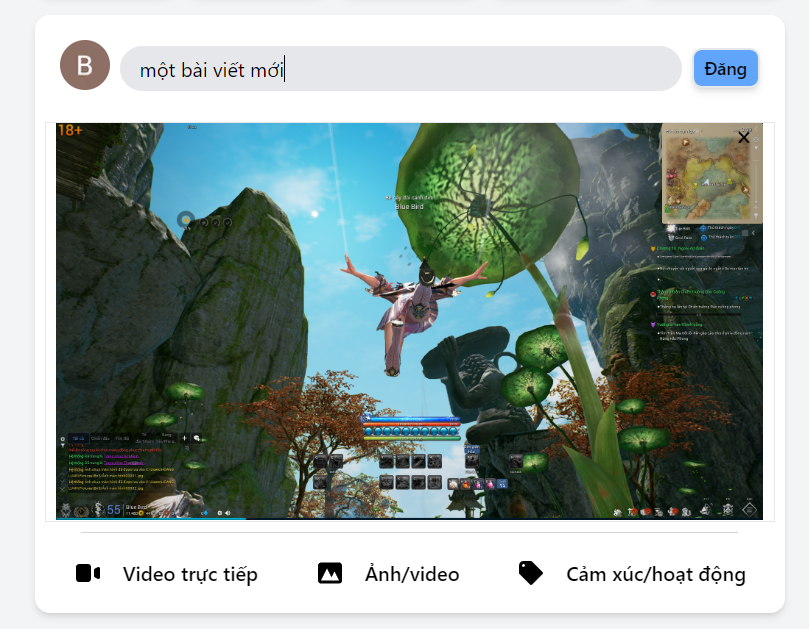
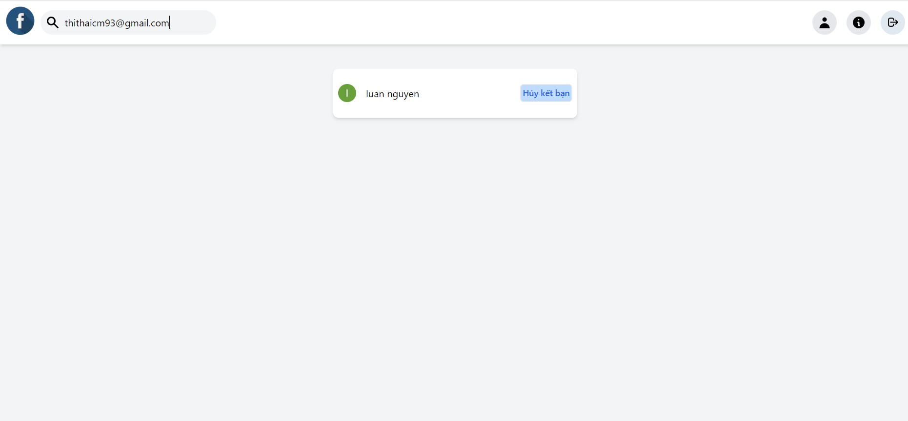

# Facebook app

Here is the live demo https://facebook-clone-gray.vercel.app/

A Social media apps build with Nextjs, Tailwindcss, Firebase

## Feature

- Signin with your gmail
- Add/delete posts
- React/comment friends's posts
- Chat realtime with friends

## Technologies

- Nextjs: 12.2.2
- Tailwindcss: 3.1.5
- Firebase: 9.9.1

## Screenshots

Login with your gmail

Homepage with posts, friends, chatbox,...

Create a new post with image.

Find your friend by their gmail

## Set up

Download or clone the repository

In the project directory, you can run:

npm start
Runs the app in the development mode.
Open http://localhost:3000 to view it in the browser.

The page will reload if you make edits.
You will also see any lint errors in the console.

## Approach

I used all the stuff that I have learned recently to build this app and also applied the BEM naming style for my CSS class names. This project helped me a lot to get used to all of these new knowledge and realize what needs to be learned to develop this app and afford to carry out my new projects
